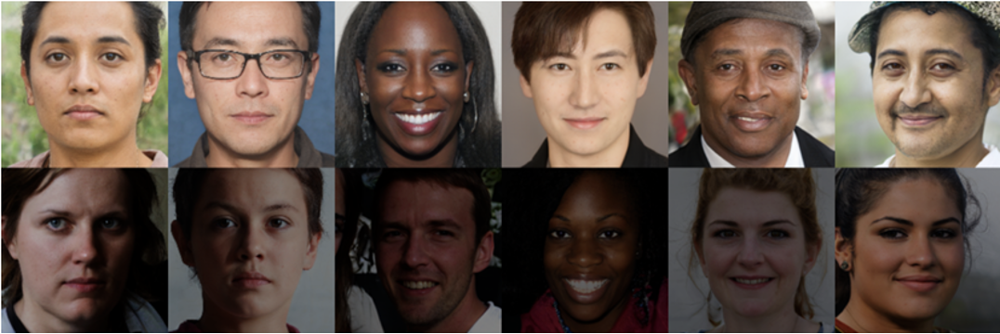
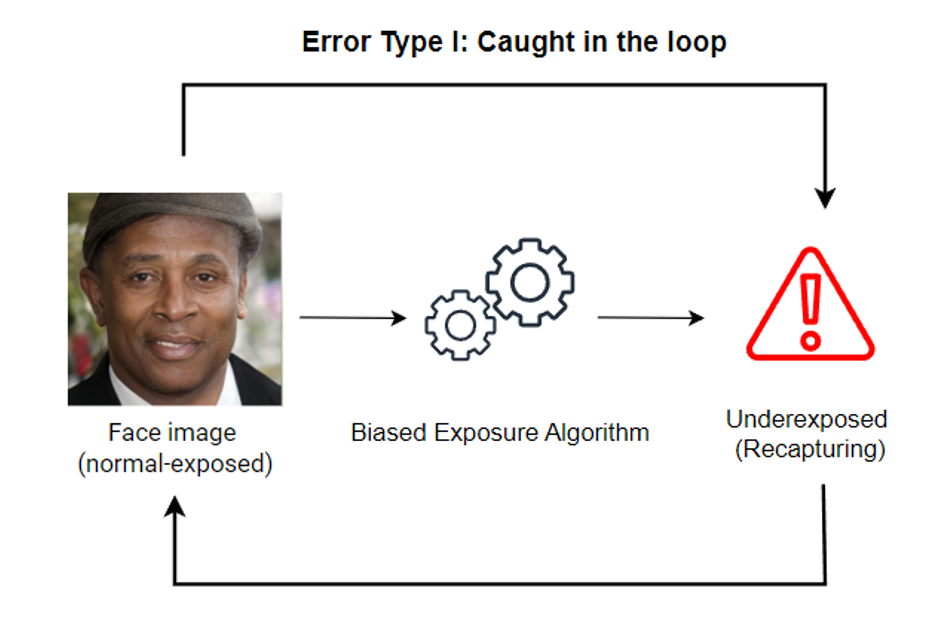

<h1 align="center"> Detection and Mitigation of Bias in Under Exposure Estimation for Face Image Quality Assessment</h1>
<p align="center">

<p align="center">

  <p align="center">
    <a href="https://dasec.h-da.de/staff/andre-doersch//"><strong>André Dörsch</strong></a>    
    ·
    <a href="https://dasec.h-da.de/staff/christian-rathgeb/"><strong>Christian Rathgeb</strong></a>
    ·
    <a href="https://www.ntnu.no/ansatte/marceg"><strong>Marcel Grimmer</strong></a>    
    ·
    <a href="https://www.ntnu.edu/employees/christoph.busch"><strong>Christoph Busch</strong></a>

  </p>
  <p align="center">
  
</p>
  <h2 align="center">BIOSIG 2024</h2>
  <div align="center">
  </div>

  This repository contains the official implementation of the [BIOSIG 2024](https://biosig.de/) paper: **Detection and Mitigation of Bias in Under Exposure Estimation for Face Image Quality Assessment**

## News
### October 2024
 + Inference code and model weights to run our underexposure estimation are now available. 

## Overview

This research work contributes to the development of fair biometric systems by introducing an alternative model for underexposure estimation, resulting in more fair and reliable decisions across diverse populations.

### The underlying problem
We found that many existing underexposure quality algorithms tend to disfavour individuals with darker skin tones, resulting in biased decisions. 

<p align="center">
  
</p>

If a captured facial image with darker skin tone is incorrectly claimed as underexposed due to a biased algorithm - which may include demographic variables such as skin color in the decision - and therefore rejected, the person cannot take meaningful action and may feel discriminated against. 
## Abstract
The increasing employment of large scale biometric systems such as the European "Entry-Exit System" and planned national initiatives such as the "Live Enrolment" procedure require quality assessment algorithms to ensure reliable recognition accuracy. Among other factors, facial image quality and hence face recognition accuracy can be negatively impacted by underexposure. Therefore, quality assessment algorithms analyse the exposure of live-captured facial images. To this end, mainly handcrafted measures have been proposed which are also referenced in current standards. However, this work shows that handcrafted measures, which use basic statistical approaches to analyse facial brightness patterns, exhibit racial bias. It is found that these algorithms disproportionately classify images of black people as underexposed as they do not take into account natural differences in skin color, particularly when relying on average pixel brightness values. To ensure fair biometric quality assessment, we have fine-tuned a data-efficient image transformer (DeiT) on synthetic data. The resulting underexposure estimation outperforms state-of-the-art algorithms in detection accuracy and biometric fairness. Precisely, an Equal Error Rate (EER) of approximately 7% is achieved. Our findings highlight the importance of developing robust and fair biometric classification methods to mitigate discrimination and ensure fair performance for all users, regardless of their skin color.


## Inference Setup
### 1. Clone the repository:
```
git clone https://github.com/dasec/FIQA-Underexposure-Bias.git
```
### 2. Requirements
To install all necessary dependencies, a suitable <a href="https://docs.conda.io/projects/conda/en/latest/index.html">Conda</a> environment named `UnderExposureInference` can be created and activated by running the following command in your terminal:
```
conda env create -f requirements.yaml
conda activate UnderExposureInference
```

### 3. Download necceccary files
To download the required PyTorch model and the sample images for demo purposes, proceed as described in the following steps.

**Link**: https://cloud.h-da.de/s/XLSBQ86FkjbmHma

**Password**: 4k74nfeL?yHLoxr#


#### 3.1 Download the required model file
Download the ``deit_base_underexposure_checkpoint5.pth`` file and place it in the local models folder
#### 3.2 Download the demo_data.zip folder
Download and unzip the ``demo_data.zip`` file and place the folders in the local demo_data folder

Your local folder structure should now be similar to:
```
...
├── models/ 
│   └── deit_base_underexposure_checkpoint5.pth
│
├── demo_data/
│   └── normal_exposure/
│   │   └── 1640489_39_F_latino_hispanic_9_cropped.png
│   │   └── 4219869_33_F_black_1_cropped.png
│   └── under_exposure/
│       └── 856813_49_M_indian_7_cropped.png
│       └── 5256019_40_F_latino hispanic_3_cropped.png
...
```

## Usage
### Running inference on the demo data
We **recommended** this section to check whether the setup has worked successfully and to familiarize yourself with the inference script.
````
usage: inference.py [-h] [--model MODEL] [--input INPUT] [--output OUTPUT]

options:
  -h, --help       show this help message and exit
  --model MODEL    Path to the model checkpoint .pth file
  --input INPUT    Path to the directory of the image. The folder structure must be as shown in the demo
  --output OUTPUT  Path to the output CSV file for storing the predictions
````


Run the following command for using the inference script on the provided demo_data folder in your terminal:

```
python src/inference.py --input demo_data --model models/deit_base_underexposure_checkpoint5.pth --output "demo-predictions.csv"
```

This will write the models predictions into the ``demo-predictions.csv`` file.


### Running inference on your own dataset
If you want to run the inference script on your own dataset, you must follow a few additional pre-processing steps, which also requires the development of customized pre-processing scripts.

#### Data preparation
**1. Image Alignment**: Facial images processed by the model **must** be correctly aligned. This step is important as different alignment methods may influence the model performance. The alignment should follow the FFHQ dataset pre-processing alignment function, which can be found in the <a href="https://github.com/NVlabs/ffhq-dataset/blob/master/download_ffhq.py">NVIDIA Research Projects FFHQ-Dataset</a>. For facial landmark detection, we used <a href="http://dlib.net/">Dlibs</a> Shape Predictor.

**Information**: You are free to use other alignment and landmark detection methods. However, we cannot guarantee that the model will perform as expected if you choose to use different alignment and landmark detection methods.

**2. Image Cropping**:. After aligning your own images, they **must** be cropped properly. Examples of correctly aligned and cropped facial images are provided in the `demo_data.zip` folder. 

**3. Folder-Structure**: Ensure that your input image directory follows this specific folder structure if you do not wish to modify the `src/inference.py` script:

```
├── your_own_dataset/
│   └── normal_exposure/
│       ├── your_properly_aligned_and_cropped_image_1.png
│       ├── your_properly_aligned_and_cropped_image_2.png
│       └── ...
│   └── under_exposure/
│       ├── your_properly_aligned_and_cropped_image_3.png
│       ├── your_properly_aligned_and_cropped_image_4.png
│       └── ...
```

## Model information
We fine-tuned a data-efficient image transformer (DeiT) as described by Touvron et al in <a href="http://proceedings.mlr.press/v139/touvron21a/touvron21a.pdf">Training data-efficient image transformers & distillation through attention</a>.

More information about the model and the model card can be found here: https://huggingface.co/facebook/deit-base-patch16-224.

## Disclaimer
This model was trained on exclusive high quality synthetic data. Although various augmentations were applied during training, it cannot be ruled out that the model performance varies greatly due to the domain gap in field data. If your data quality and facial images differ greatly from the training data, you may need to customize and fine-tune the model on your data.

## Citation

If you use this repository and found it useful for your research, please consider citing this paper:

```
@inproceedings{Dörsch-FIQA-UnderExposureBias-BIOSIG-2024,
              Author = {A. Dörsch and C. Rathgeb and M. Grimmer and C. Busch},
              Booktitle = {Proc. Intl. Conf. of the Biometrics Special Interest Group ({BIOSIG})},
              Groups = {ATHENE},
              Journal = {Conf. of the Biometrics Special Interest Group ({BIOSIG})},
              Month = {September},
              Publisher = {IEEE},
              Title = {Detection and Mitigation of Bias in Under Exposure Estimation for Face Image Quality Assessment},
              Year = {2024}
}
```